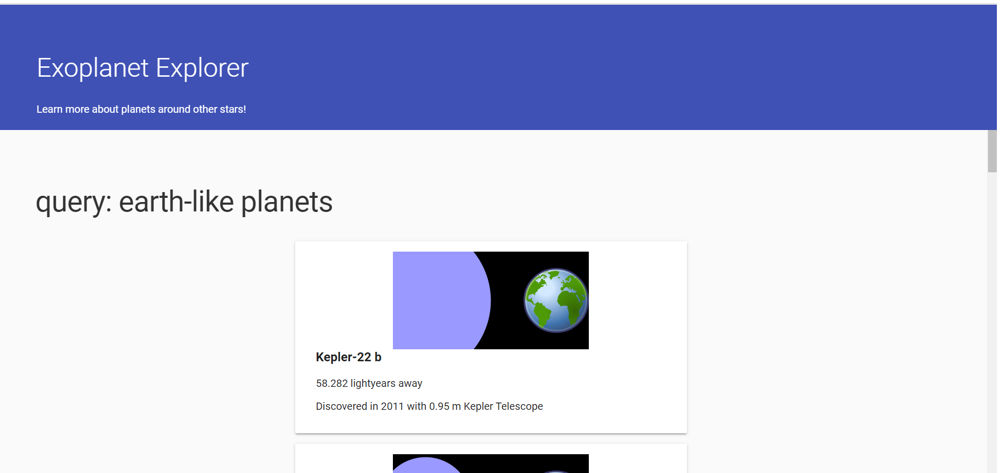

# exoplanet-explorer
App to find out information of earth like planets.

Project contains sample app written to learn,

* Promise 
* Fetch API

starter code provided by **udacity**

project screen:

